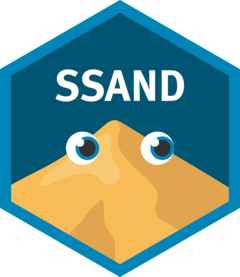

# SSAND 
This package (pronounced "sand") aims to consolidate the code used to generate plots and tables for stock assessments and associated documentation. 

This package strives to provide universal code that can provide consistent outputs for multiple stock assessment models. SSAND currently works with Stock Synthesis and DDUST, but can be extended to more models. 

There are generally two kinds of functions you will find in here:
* Data preparation functions, specific to the stock assessment model used (e.g. Stock Synthesis or DDUST)
* Plotting functions, agnostic to the model that is used

There are also a series of plots that can be used to explore raw catch and effort data.

Most of the documentation for using this package can be found in the vignettes.
``` r
library(SSAND)
vignette("Introduction", package = "SSAND")
```

Calling `catalogue()` will produce a guide of all the plots on offer within the package. 

Calling `template()` will produce a full stock assessment report with all plots, tables and calculated values in place. The report works from the pre-loaded Stock Synthesis example data, but you can easily enter your own model outputs.

Calling `investigate(data = format_logbooks(raw_data))` will produce a suite of plots and tables that can be used to interrogate raw catch and effort logbook data. 

``` r
library(SSAND)
catalogue()
template()

# To look at raw logbook data
investigate(data = format_logbooks(raw_data))

# To look at model outputs (using Stock Synthesis as an example)
ss_mle <- list(r4ss::SS_output(dir1), r4ss::SS_output(dir2), r4ss::SS_output(dir3))
ss_mcmc <- list(r4ss::SSgetMCMC(dir1), r4ss::SSgetMCMC(dir2), r4ss::SSgetMCMC(dir3))
data <- biomassplot_prep_SS(ss_mle,ss_mcmc)
biomassplot(data)
```

## Suggested SSAND workflow

``` mermaid
flowchart TB

        direction TB
		A("(External) Logbook pull"):::External--> B("SSAND: Logbook data formatting"):::SSAND
        B--> C("SSAND: Logbook data investigation plots"):::SSAND
        C--> D("(External) Prepare model inputs"):::External
        D--> E("SSAND: CPUE diagnostics (in development)"):::SSAND
        E--> F("(External) Stock assessment MLE modelling"):::External
        F--> G("SSAND: MLE diagnostics (in development)"):::SSAND
        G--> H("(External) Stock assessment MCMC modelling"):::External
        H--> I("SSAND: MCMC diagnostics"):::SSAND
        I--> J("SSAND: Load report template"):::SSAND
        J--> K("SSAND: Generate plots, tables and values for report"):::SSAND
        K--> L("SSAND: Communication package"):::SSAND

	
        B---b("format_logbooks()"):::Functions
        b---C
        C---c("investigate() and 
        functions in resulting investigate.Rmd"):::Functions
        c---D
        E---e("In development \n influenceplot()"):::Functions
        e---F
        G---g("In development.
        likelihoodplot(), pinerplot(), 
        sensitivityplot(), correlationplot()"):::Functions
        g---H
        I---i("mcmc_rhatplot(), mcmc_traceplot(), 
        mcmc_posteriordensityplot(), correlationplot()"):::Functions
        i---J
        J---j("template()"):::Functions
        j---K
        K---k("See functions in context inside 
        template.Rtex, produced by template()"):::Functions
        k---L
        L---l("managementplot(), webcatchplot()"):::Functions


    classDef SSAND fill:#005672,stroke:#0085b8,color:#ffffff
    classDef External fill:#006A4B,stroke:#00925B,color:#ffffff
    classDef Functions fill:#f8bc57,stroke:#e0a54e,color:#000000


linkStyle default stroke:black
linkStyle 11,13,15,17,19,21,23 stroke-width:2px,stroke:#e0a54e
linkStyle 12,14,16,18,20,22,24 stroke-width:0px,stroke:white
```



## Installation

You can install the development version of SSAND from
[GitHub](https://github.com/) with:

``` r
# install.packages("devtools")
devtools::install_github("QLD-Fisheries/SSAND", auth_token = 'abcdef_123456_ghijklm_7890', build_vignettes = TRUE)
```

Currently the repo is private and you need a Personal
Access Token (PAT) to access it. From your Github profile, go to
**Settings** -\> **Developer Settings** -\> **Personal access tokens**
-\> **Tokens (classic)** -\> **Generate new token (classic)**. Add a
note, choose an expiration length, check all the required scopes and
Generate Token. Save your token. Configure SSO and select QLD-Fisheries
to authorise the token. Now you can install the repository with:


Installation of this package will enable you to load the package within an R session using `library(SSAND)` which will import all plotting functions for use in your R session.

If you are using RStudio/Posit, consider writing a snippet to save yourself the trouble of digging up your auth_token every time your want to update the package. You can write a snippet in RStudio by clicking Tools > Edit code snippets and adding one at the bottom of the list within the R tab. Ensure the tab spacing is correct and you have an empty line following it.  


Now when you type the word 'ssand' into RStudio then press Shift+Tab, it will autocomplete with the entire line. You can then press enter to update the package. 
